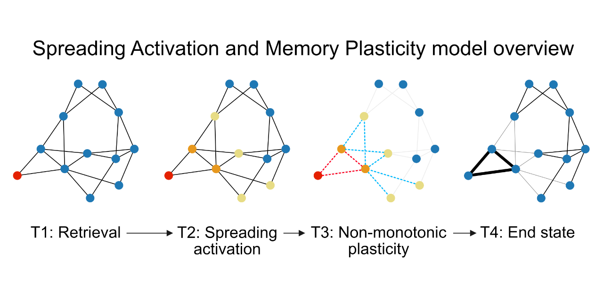

# SAMPL: The Spreading Activation and Memory PLasticity Model

## Authors

Beau Sievers1, Ida Momennejad2

1 Department of Psychology, Harvard University, Cambridge, MA 02138

2 Department of Biomedical Engineering, Columbia University, New York, NY 10027

## About

This repository contains code for running the simulations and analyses described in the paper "SAMPL: The Spreading Activation and Memory PLasticity Model," available at: https://www.biorxiv.org/content/10.1101/778563v1

This repository does **NOT** contain the [word2vec embedding of the Google News Dataset](https://drive.google.com/file/d/0B7XkCwpI5KDYNlNUTTlSS21pQmM/edit?usp=sharing), which is required to run the Anderson, Bjork, and Bjork (1994) and two-agent memory convergence simulations. Before running these simulations, place the Google News embedding file in the `/data` directory.

## Requirements

All code was tested on Mac OS 10.14.6. Library requirements are listed in `requirements.txt`.

## File structure

- `/sampl`: code implementing the SAMPL model
- `/sampl/parameter_search_all.py`: code for running parallelized grid search
- `/grid_search_results`: cached results from grid search (to save time)
- `/notebooks`: Jupyter notebooks for running simulations and plotting results
- `/data`: place the word2vec embedding of the Google News dataset here

## Citation

Sievers, B., Momennejad, I., (2019, September 23). SAMPL: The Spreading Activation and Memory PLasticity Model. Retrieved from https://www.biorxiv.org/content/10.1101/778563v1

## License

This software is made available under a BSD-style license. See the `LICENSE` file.

## Last updated

This document was last updated on September 23, 2019.
